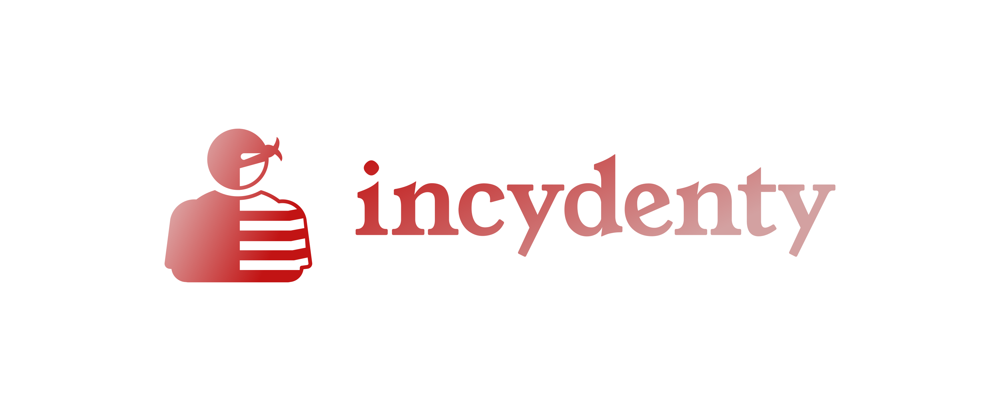

# logo

[logo.incydenty.pl](https://logo.incydenty.pl/)

## Font

Font in use <a target="_blank" href="https://github.com/uplaod/YoungSerif">YoungSerif-Regular</a> designed by
<a target="_blank" href="http://sozoo.fr/">Bastien Sozeau</a>
and licensed under
<a target="_blank" href="http://scripts.sil.org/cms/scripts/page.php?site_id=nrsi&amp;id=OFL_web">Open Font License.</a>
Icon Designed by
<a target="_blank" href="https://thenounproject.com/jorge.reyes.798278">Jorge Reyes</a>

## Colors 

### Font

    #C21414, #D3A1A1
    

### Background
    
      transparent

### Icon

    #E6D6D6, #C21414

# Logo

## 1

## 2

## 3

